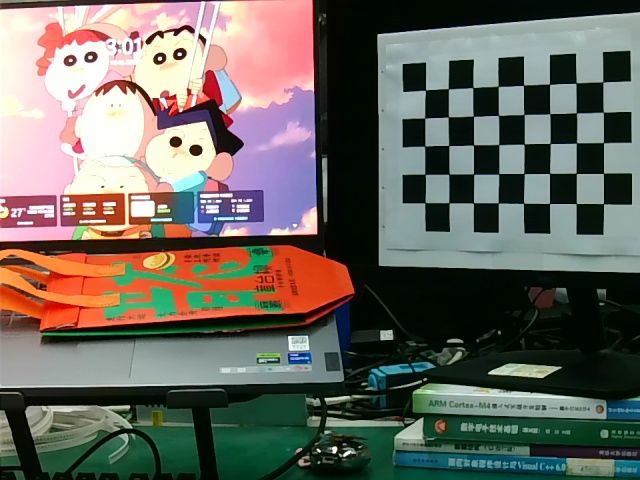

# [Calibration and Stereo mapping]

Code for entire stereo calibration and mapping process: 
- Calibration (intrinsic, extrinsic)
- Distortion compensation
- Epipolar calibration
- Stereo matching & disparity
- Depth
- Point cloud

# Demo
- <p><b>left and right image<b><p>
          
- <p><b>disparity and depth map<b><p>
          

## 🛠️ Build

```
mkdir build
cd build
cmake ..
make
```


## 📷 Take photos

Connect you computer with a pair of cameras fixes on the rig. Run the following command and press space to take chessboard photos from different perspectives. 
```
cd build
./photo
```

You can also directly put your images into ./images folder as:
```
└── images/
    ├── origin_left/
    │   ├── image_0.jpg
    │   ├── image_1.jpg
    │   ├── image_2.jpg
    │   └── ...
    └── origin_right/
        ├── image_0.jpg
        ├── image_1.jpg
        ├── image_2.jpg
        └── ...
```


## 🤖 Intrinsic calibration

Run the following line to get you intrinsic and distortion params.

```
./intrinsic
```


## 👾 Distortion compensation

Run the following line to compensate the distort of images.

```
./undistort
```


## ⚙️ Extrinsic and Epipolar calibration

Run the following line for extrinsic and epipolar calibration.

```
./epipolar_calibration
```


## 🚀 Stereo matching & Disparity & Depth & Point cloud

Run the following line to get your disparity, depth and point cloud.

```
./stereo
```

## 🧐 Point cloud visualization

Run the following line to visualize your point cloud (you should have open3d installed first).

```
pip install open3d
cd ..
python ./cloud_viz.py
```

<video width="640" height="480" controls>
  <source src="./pointcloud.webm" type="video/webm">
</video>
